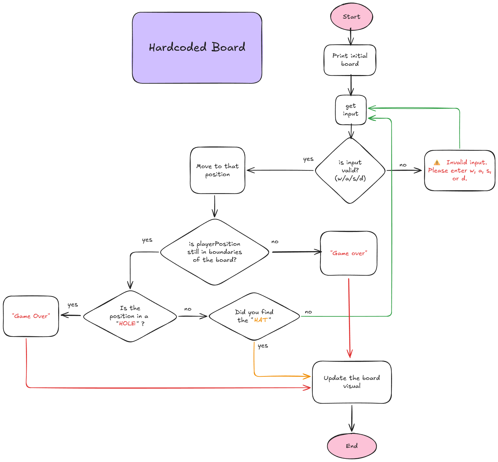

# Thinking Process Guidelines

## Table of Contents

- [Thinking Process Guidelines](#thinking-process-guidelines)
  - [Table of Contents](#table-of-contents)
  - [1. Workflow Planning](#1-workflow-planning)
  - [2.1. Board Functions (Hardcoded)](#21-board-functions-hardcoded)
  - [2.2. Board Functions (Generated)](#22-board-functions-generated)
  - [3. Input Functions](#3-input-functions)
  - [4. Movement Functions](#4-movement-functions)
  - [5. Game Rule Functions](#5-game-rule-functions)
  - [6. Game Play Loop](#6-game-play-loop)
- [WRITE YOUR THINKING PROCESS BELOW. ](#write-your-thinking-process-below)

## 1. Workflow Planning

↳ Draw a flowchart or write steps describing:

Game start
→
Read input
→
Update position
→
Check rules
→
End/Continue

↳ Must include:

- Input/output of each function.
- Edge cases (invalid input, boundaries, hole/hat tiles).

## 2.1. Board Functions (Hardcoded)

↳ Prints the hardcoded board in terminal.

Thinking process should explain:

- How the board is represented (2D array).
- Tile types (PLAYER, EMPTY, HOLE, HAT).

## 2.2. Board Functions (Generated)

↳ Creates a random board with player, hat, and holes.
↳ Prints the board in terminal.

Thinking process should explain:

- How the board is represented (2D array).
- Tile types (PLAYER, EMPTY, HOLE, HAT).
- How random placement avoids overlaps.

## 3. Input Functions

↳ Reads and validates user input (w, a, s, d).
↳ Logs invalid input.

Thinking process should explain:

- Input/output.
- Edge cases (invalid input, boundaries).
- How player position is updated.

## 4. Movement Functions

↳ Updates playerRow / playerCol based on the move.

Thinking process should explain:

- Input/output.
- Edge cases (invalid input, boundaries).
- How player position is updated.

## 5. Game Rule Functions

↳ Checks for out-of-bounds, falling into a hole, or finding the hat.

&nbsp;Game Rules:&nbsp;

- Wins by finding the hat.
- Loses by landing in a hole.
- Loses by moving outside the board.

Thinking process should explain:

- How to determine win/loss conditions.
- Handling messages for win/loss conditions.

## 6. Game Play Loop

↳ Combine all functions into a playable loop.
↳ Ensure messages appear correctly, board prints at start, and invalid input is handled.

Thinking process should explain:

- How to determine win/loss conditions.
- Handling messages for win/loss conditions
- How to update the board when the player moves.

---

# 
WRITE YOUR THINKING PROCESS BELOW.&nbsp;

<!-- Thinking Process -->
<!-- 1. Workflow Planning -->

<!-- 2.1. Board Functions (Hardcoded) -->
## function printBoard()
- ผมต้องการสร้าง board temporary (จะขอเรียก tempBoard) แยกจาก Hardcoded board เอามาเช็คเทียบ โดยไม่ไปยุ่งกับข้อมูล board เดิม
- ผมจะใช้ nested loop วนลูป Hardcoded board แล้วเก็บค่าเข้าไปใน tempBoard
- ถ้าตำแหน่งของ player ณ ตอนนั้นตรงตำแหน่งไหนใน board ก็จะใส่ค่า "*" เข้าไปแทนที่ตอนเก็บค่าใน tempBoard และ loop จนครบ
- ถ้า player มีการขยับออกจากตำแหน่งปัจจุบัน จะแทนที่ในตำแหน่งก่อนหน้า (prevPlayerRow, prevPlayerCol) ด้วย "░" เพราะไม่งั้นเวลาขยับออกมา "*" ณ ตำแหน่งเดิมจะยังอยู่

<!-- 2.2. Board Functions (Generated) -->
<!-- 3. Input Functions -->
## function getInput()
- นำตัวแปรประกาศ prompt() ที่จะเก็บค่า input มาไว้ใน function นี้
- if else เช็ค input ว่าใส่มาเป็น w/a/s/d ไหม ถ้าใช่ก็ return input ตรงๆเลย
- else ให้ส่ง string ยาวเป็นข้อความ Error ไปเก็บไว้ และ log ออกมาเตือนว่าให้ player กรอกใหม่
<!-- 4. Movement Functions -->
## function isMoving(validInput)
- รับค่า input ที่ถูกต้อง (validInput) มาจาก function getInput()
- เขียน switch case ขึ้นมาโดนให้ key เป็น validInput ซึ่งเป็น true เสมอ ซึ่งมีค่า string ที่ผ่านการเช็คมาแล้ว
- เมื่อตรงกับ case ไหน ก็ให้ทำการอัพเดทค่าตำแหน่ง player (playerRow, playerCol)
<!-- 5. Game Rule Functions -->
## function ruleChecker()
- หลังจากอัพเดทตำแหน่ง player (playerRow, playerCol) ไปแล้วใน function isMoving ก็มาเช็คต่อในนี้
- เช็คว่าตำแหน่งยังอยู่ใน metric hardcoded board หรือไม่ ไม่ตกไปในช่อง "O" หรือปล่าว หรือเดินไปเจอหมวก!
- ถ้าตกหลุมและเดินเกิน board ก็จะจบทันที(playing = flase) log ข้อมความ game over!
- ส่วนถ้าเก็บหมวกได้ ก็จะจบเช่นกัน(playing = flase) แต่ข้อความแสดงผลจะต่างไป
- แต่ถ้าไม่ใช่เลย แสดงว่า player ยังเดินบนพื้นอยู่ ก็ให้ล่นต่อไป (playing = true)

<!-- 6. Game Play Loop -->
## Game Play Loop
- ผมใช้การ loop ด้วย while loop โดยค่าที่ทำให้มันวนต่อไปได้คือตัวแปล Global ที่ชื่อว่า "playing" ที่มีค่าเป็น true
- จะวนไปเรื่อยๆจนว่า function ruleChecker() จะทำการเปลี่ยนค่าเมื่อเข้า conditions
- เริ่มด้วย printBoard() เพื่อ log board เริ่มต้นให้ผู้เล่นเห็น
- isMoving(getInput()) ให้ isMoving รับค่า getInput เพื่ออัพเดทตำแหน่ง player
- ruleChecker() เพื่อเช็คว่าตำแหน่ง player ยังเป็นไปตามกฏหรือไม่
- หลังจากเช็ค ถ้า playing = true ก็ขึ้น loop ถัดไป
- รอบใหม่ printBoard() log board ที่ได้รับการอัพเดทค่าตำแหน่งจาก player ณ ตรงนี้ถ้าค่าที่อัพเดทมา เป็น invalid input หลังจาก log ค่า board เดิมที่ไม่มีการเปลี่ยนแปลงเพราะใส่ค่าผิด ก็จะ log ค่า input Error Message ออกมาเตือนให้ใส่ค่าเข้าไปใหม่ให้ตรง
---
[Back to Table of Contents](#table-of-contents)
